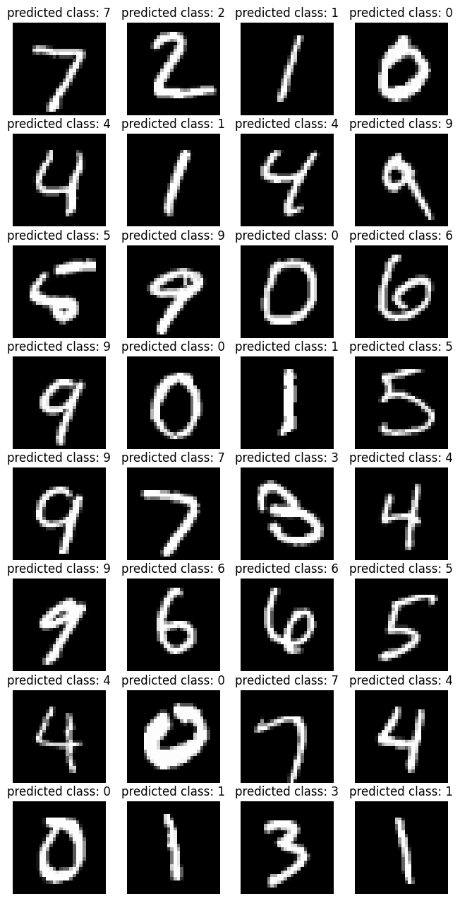

## 👋 Project Description  
This project implements a convolutional neural network (CNN) based on the **LeNet-5** architecture, designed by **Yann LeCun**, to classify handwritten digits from the **MNIST** dataset.  
The goal is to build a high-accuracy digit recognition model using deep learning techniques.

---

## 📁 Project Structure  
```
mnist-lenet/
data/                  # Contains the MNIST dataset
models/                # Saved models
notebooks/             # Jupyter notebooks for training statistics and test model
src/                   # Project source code
    train.py           # Model training script
    utils.py           # Utility script for displaying data
    model.py           # LeNet-5 architecture definition
    preprocess.py      # Data preprocessing
requirements.txt       # List of required dependencies
README.md              # Project documentation
config.yaml            # Hyperparameter configuration
```

---

## 🚀 Installation & Usage  

### 1. Clone the repository  
```bash
git clone https://github.com/your-username/mnist-lenet.git
cd mnist-lenet
```


### 2. install dependencies  
```bash
pip install -r requirements.txt
```

### 3. Download the MNIST dataset  
The dataset will be automatically downloaded when running the script.  
Alternatively, you can manually download it from [Yann LeCun's website](http://yann.lecun.com/exdb/mnist/).

### 4. Train the model  
```bash
python src/train.py --epochs 10 --batch_size 32 --lr 0.001
```

### 5. Evaluate the model  
```bash
jupyter notebook notebooks/train.ipynb
jupyter notebook notebooks/test.ipynb
```

---

## 🏋️ Model Architecture (LeNet-5)  


The model is based on the LeNet-5 architecture, which consists of the following layers:

1. **Input**: 28x28 grayscale images  
2. **C1 - Convolution** (6 filters 5x5, stride=1) → ReLU activation  
3. **S2 - Subsampling** (MaxPooling 2x2)  
4. **C3 - Convolution** (16 filters 5x5, stride=1) → ReLU activation  
5. **S4 - Subsampling** (MaxPooling 2x2)  
6. **C5 - Fully Connected** (120 neurons)  
7. **F6 - Fully Connected** (84 neurons)  
8. **Output Layer** (10 neurons, softmax for classification)


---

## 📊 Expected Results  
After training, the model is expected to achieve approximately **99%** accuracy on the test set.

| Metric         | Expected Value |
|----------------|----------------|
| Accuracy       | ~99%             |
| Loss           | < 0.05            |
| Training Time  | ~5 minutes (GPU)  |

---


## 📈 Results Visualization  
Here are some example predictions after training:



---

## 🛠️ Technologies  
- **Python 3.9**  
- **PyTorch** 
- **NumPy, Pandas**  
- **Matplotlib / Seaborn**
